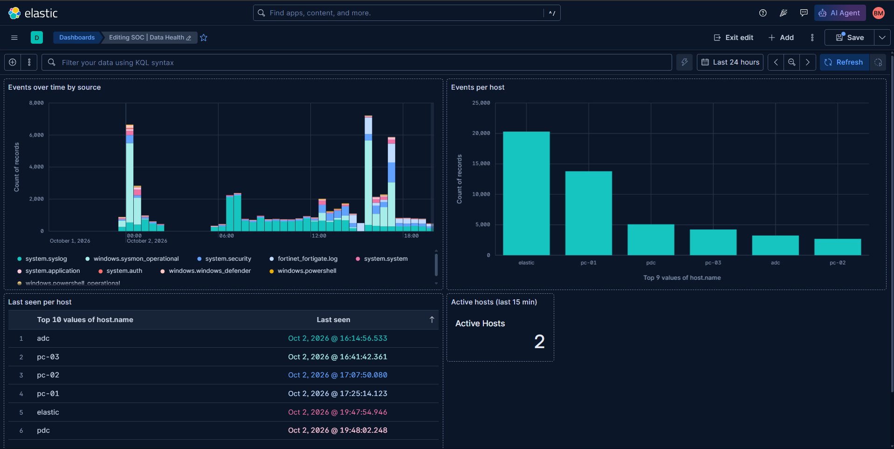
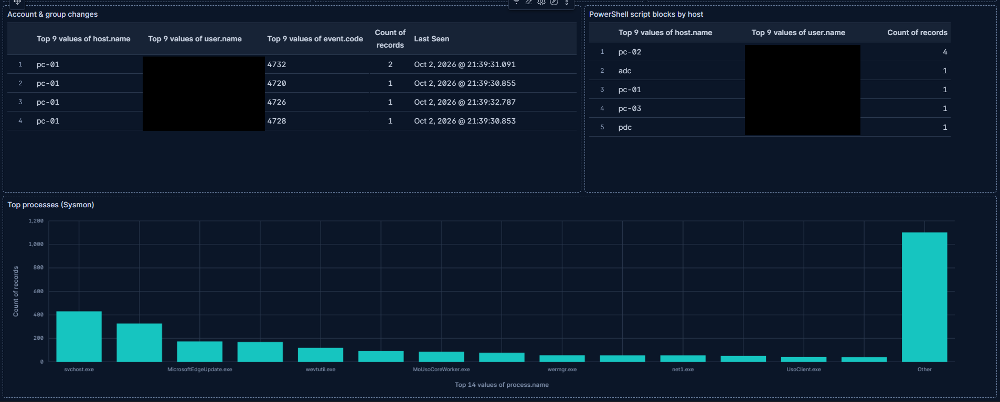
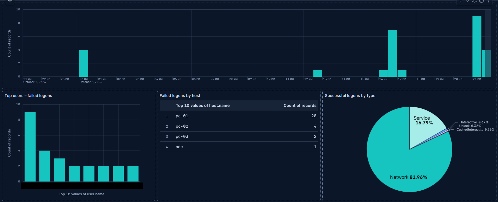

# 04 - Dashboards

Kibana dashboards and visualizations for SOC monitoring.

Put here:
- Exported dashboards / saved objects (`.ndjson`)
- Screenshots and short descriptions of each dashboard's purpose and audience
- KPI definitions (alert volume, MTTD, MTTR, true/false positive rate)

Owner: Dashboards, SOAR & AI

---

## Contents

| Path | What |
|------|------|
| `exports/soc-dashboards-v1.ndjson` | Kibana export: 2 dashboards + 3 data views |
| `images/` | Dashboard screenshots (sanitized) |

Data view definitions and gotchas: [02-onboarding/data-views.md](../02-onboarding/data-views.md).

> Unredacted original screenshots are kept in the team Google Drive (`01-Evidence/Phase2-Design-LabSetup`), **not** in the repo.

## SOC | Data Health

**Purpose:** Confirm that every log source and host is ingesting, spot gaps and silent hosts before relying on detections.
**Audience:** Infra & Onboarding, SOC analysts (start-of-shift check).
**Data views:** `logs-*`, `SOC - Windows`

| Panel | Data view | Visualization | Details |
|-------|-----------|---------------|---------|
| Events over time by source | `logs-*` | Stacked bar | Breakdown by `data_stream.dataset`. KQL: `not data_stream.dataset : elastic_agent*` |
| Events per host | `SOC - Windows` | Bar | Top values of `host.name` |
| Last seen per host | `SOC - Windows` | Table | Max `@timestamp` per `host.name`, sorted ascending (stalest host first) |
| Active hosts (last 15 min) | `SOC - Windows` | Metric | Unique count of `host.name`, reduced time range 15m, no trendline |

## SOC | Windows & Identity

**Purpose:** Watch authentication, account changes, PowerShell and process activity on Windows endpoints and DCs.
**Audience:** SOC analysts, Detection Engineering.
**Data view:** `SOC - Windows`

| Panel | Visualization | KQL / field |
|-------|---------------|-------------|
| Failed logons over time | Bar | `event.code : "4625"` |
| Top users – failed logons | Bar | `event.code : "4625"`, top `user.name` |
| Failed logons by host | Table | `event.code : "4625"`, top `host.name` |
| Successful logons by type | Donut | `event.code : "4624"`, on `winlog.logon.type` |
| Account & group changes | Table + Last seen | `event.code : ("4720" or "4726" or "4728" or "4732")` |
| PowerShell script blocks by host | Table | `event.code : "4104"` |
| Top processes (Sysmon) | Bar | `data_stream.dataset : "windows.sysmon_operational" and event.code : "1"` |

## Saved search: FortiGate - Forward Traffic

Discover saved search for FortiGate forward traffic. **Not included in `soc-dashboards-v1.ndjson`**; recreate it manually or add it to the next export.

- **Data view:** `SOC - FortiGate`
- **KQL:** `data_stream.dataset : "fortinet_fortigate.log" and not destination.ip : "127.0.0.1"`. This excludes FortiGate local traffic; see [tuning notes](../03-detection-rules/tuning-notes.md).
- **Columns:** `source.ip`, `destination.ip`, `network.transport`, `network.protocol`, `event.action`, `source.user.name`

Screenshot: [02-onboarding/images/20261002_basel_fortigate-forward-traffic.png](../02-onboarding/images/20261002_basel_fortigate-forward-traffic.png)

## Import the dashboards

1. In Kibana: **Stack Management > Saved Objects > Import**.
2. Select `exports/soc-dashboards-v1.ndjson`.
3. If asked about conflicts, choose **Check for existing objects** and **Automatically overwrite conflicts** only on a fresh stack. Otherwise pick **Request action on conflict**.
4. Click **Import**, then open **Dashboards** and search for `SOC |`.

The export includes the data views (`logs-*`, `SOC - Windows`, `SOC - FortiGate`), so the panels work without creating data views first.

## Planned

| Dashboard | Content | When |
|-----------|---------|------|
| SOC \| Network (FortiGate) | FortiGate network traffic (data view `SOC - FortiGate`) | Phase 3 |
| SOC \| Operations | Alert volume, MTTD, MTTR, closure rate, top attackers, top targets | After detection rules exist (Phase 3) |
